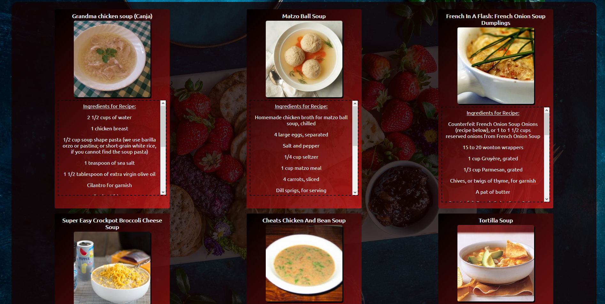

# Down-Right-Tasty: A Recipe Search App

## Live Link
https://kotieheim.github.io/recipe-hack-capstone/

## Screenshots

## Summary:

Down-Right-Tasty will accept a search query from the user and return recipes from the Edamam.com API pertaining to what the user searched. This will include a clickable thumbnail and title that'll lead to a link of the recipe, as well as a preview of the ingredients and a video of the recipe, using YouTube's API, that is embedded and also clickable to go to the location on YouTube.

## Technology Used:

* HTML
* CSS
* JavaScript
* jQuery
